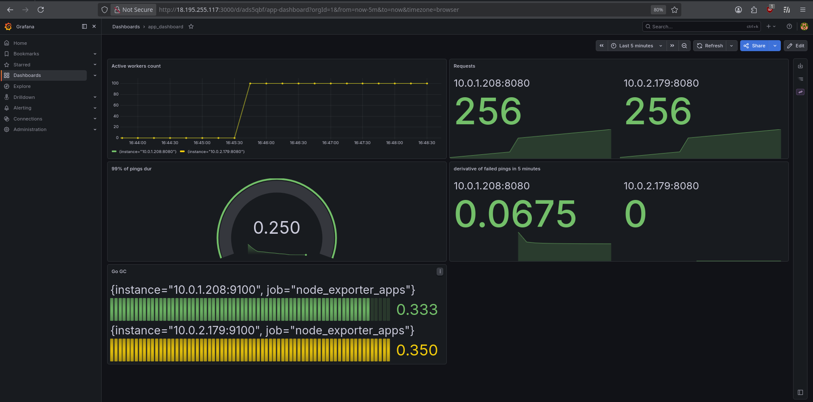

# Gopher-Pinger
---
Automated pinger made with **Go**, receives only interval and URL, and you can check status of your pinger, your last ping status and time anytime

[](https://goreportcard.com/report/github.com/Zapi-web/gopher-pinger)

[](https://github.com/Zapi-web/gopher-pinger/actions/workflows/main.yml)

## Architecture
* **Go** - main project language, all logic with API
* **Terraform** - IaC instrument, auto server up
* **AWS** - Priority cloud for Terraform
* **Redis** - Fast cache database, stores all IDs and last values of pings
* **Ansible** - Auto project configuration
* **Docker** - Isolated process run
* **Prometheus** - Collecting metrics from app and metal
* **Grafana** - Structured dashboards of app

## Features
* - **Structured logging:** All logging in the app processing with slog/json
* - **ULID:** Using ULID instead of UUID for better performance and sorting
* - **Automated deploy** process: you can just type `make deploy`, and you will get 4 servers with observability, database, and apps
* - **Minimum requirements:** all code performance was tested on **AWS-free tier** machines
* - **Performance:** code can handle on 2 **t3.micro** machines **700+** concurrent connections and **4000+ RPS** (Max Latency: **1.3s**)

## How to install
1. make a `terraform.tfvars` file in `infrastructure/terraform`
```hcl
key_name = "--YOUR-AWS-KEY-NAME--"
admin_ip = "0.0.0.0/0" # or get it from any web-site
```
2. That's all, now just use make command
```bash
make deploy KEY_PATH=~/.ssh/--YOUR-AWS-KEY-NAME--.pem
```
3. Done!

## Endpoint and ports
* POST /newPinger `{"url": "https://example.com", "interval": 10}` starts a new pinger with interval 10 seconds
* GET /getPinger `{"id": "your-ulid"}` you will get all information about last ping and last code status
* PUT /changeInterval `{"id": "your-ulid", "interval" 10}` updates an interval of your pigner
* DELETE /deletePinger `{"id": "your-ulid"}` deletes your pinger

### Ports
`8080` - go app
`3000` - grafana
`6379` - redis
`9090` - prometheus
`9100` - node-exporter
`3100` - loki
(DEFAULT PORTS)

## Grafana Dashboard picture
[](docs/img/grafana_dashboard.png)